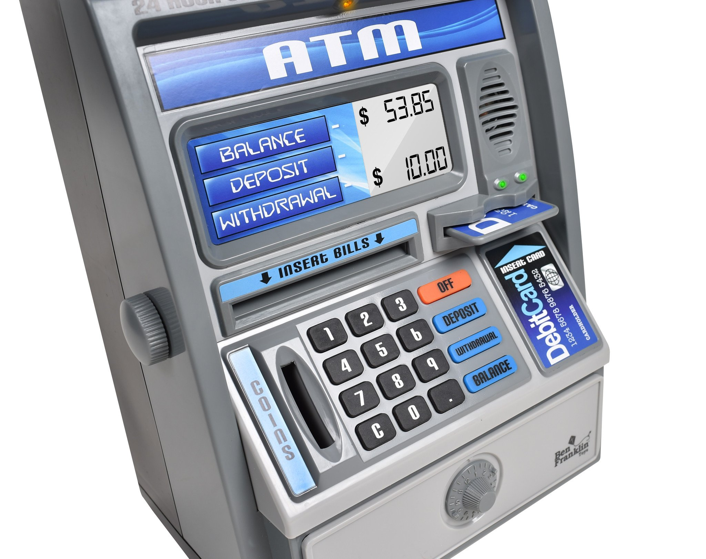

# Backend

In software development, the code that makes the display is often separated from the code that handles the data traffic. The real world contains many examples of this division: take for example an ATM:

What you can interact with, the buttons or the place where you can insert your card, is called the `frontend` (also known as the `user interface`). However, everything that's needed to make it work the way it does, i.e. the software needed to make it do the real work (moving data from one place to another) is called the `backend`.

In web development the term backend can be boiled down to 3 components:

-   A `server`: a computer that is connected to other computers, which runs an application (see below) that allows for sharing and managing services (like a calculator or word processor) and resources (like images, text files).
-   A `database`: software that manages and saves sensitive data for later use.
-   An `application`: software that communicates between the database, frontend and other servers. It contains code that allows it to interact with and manipulate the server, database and other types of software services.

For more information, read:

-   [Basics of backend development](https://www.upwork.com/hiring/development/a-beginners-guide-to-back-end-development/)
-   [Getting started with backend development](https://codeburst.io/getting-started-with-backend-development-bfd8299e22e8)

When people refer to backend programming, they usually refer to **writing the application** part of the backend: the software that interacts with a server (a computer) and database, and moves data from one computer to the next.

This software is usually a `web server` that serves as an `API`, which can be used to move data to or get data from in order to satisfies client requests.

Why would we need a backend? There are multiple reasons:

-   **Security**. We don't want any random user to directly access our sensitive data, without verifying who they are. For example, if you have an online bank account then you need to login to verify it's you. The whole process of login and verification is code written in a place (the backend) that can't be reached so easily.
-   **Performance**. The speed of our user interfaces is greatly dependent upon the server that provides it. The backend contains code that makes sure it optimally makes use of the server's resources (hardware, memory, etc.) to provide the user with the best experience.
-   **Software interactions**. A web application usually makes use of other people's software, web services. The code that communicates with these services and implements it into the frontend is also contained within the backend.

For more information, read:
[Why do we need the backend?](https://www.quora.com/Why-do-we-need-a-back-end-in-web-development-Cant-the-front-end-directly-send-requests-to-the-database)
